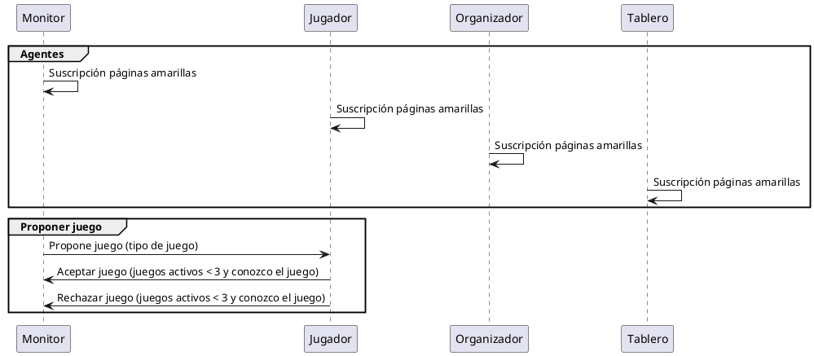

Agente jugador
==============

Suscripción paginas amarillas 

```plantuml
@startuml sequence-diagram
group Agentes
    Monitor     -> Monitor      : Suscripción páginas amarillas 
    Jugador     -> Jugador      : Suscripción páginas amarillas 
    Organizador -> Organizador  : Suscripción páginas amarillas 
    Tablero     -> Tablero      : Suscripción páginas amarillas 
end

group Proponer juego
    Monitor     -> Jugador      : Propone juego (tipo de juego)
    Monitor     <- Jugador      : Aceptar juego (juegos activos < 3 y conozco el juego) 
    Monitor     <- Jugador      : Rechazar juego (juegos activos < 3 y conozco el juego) 
end
@enduml

```