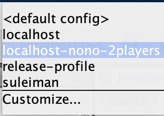
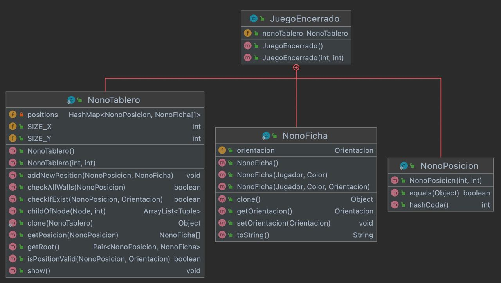
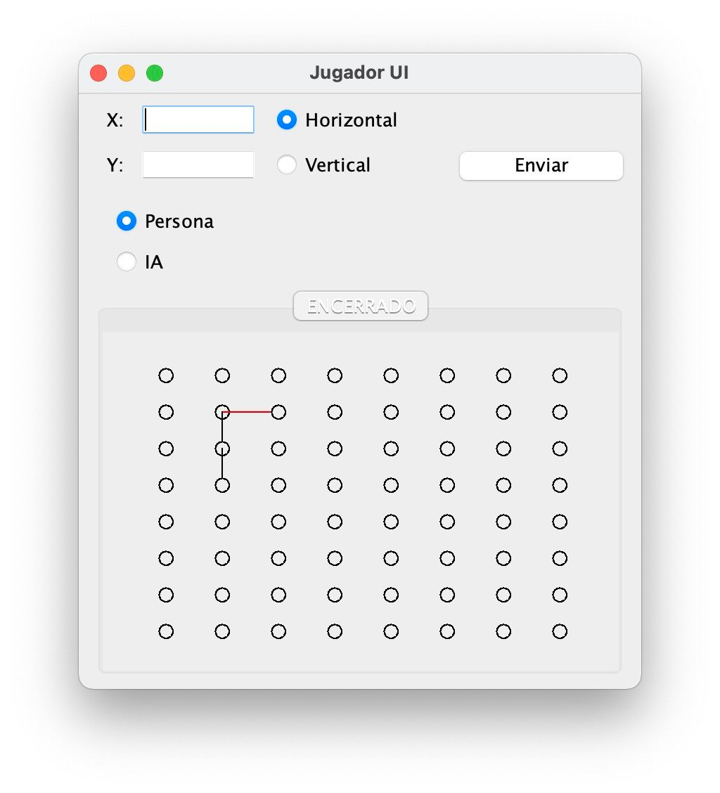
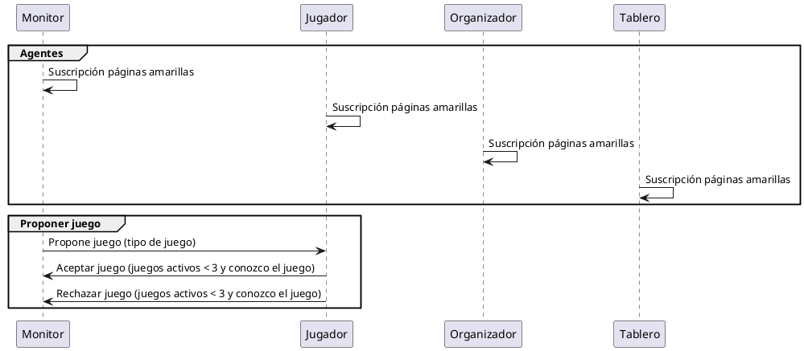

Agente jugador
==============



Hay una serie de scripts con los que lanzar cada configuración, pero recomiendo
usar el que proporciona netbeans, ya que es más sencillo lanzar distintas 
configuraciones.

# Juego_Jugador

Representa y encapsula todos los juegos a los que está jugando un jugador.
Esto es así, ya que se usa un mapa `map<String, Juego_Jugador>` con clave, 
`idJuego` y valor los estados del juego.

## Encerrado.java

Para el desarrollo de la interfaz y de la inteligencia artificial se ha creado 
la clase `Encerrado.java` que es la encargada de llevar el control completo de 
un juego, en esta clase se definio el objeto que representa el tablero, las 
posiciones y las fichas.



JuegoEncerrado tiene las 3 clases de:

### `NonoTablero.java`

Representa un tablero y está clase contiene un mapa con el que representamos las
posiciones y fichas `HashMap<NonoPosicion, NonoFicha[2]> positions`, como tal
una posición almacena dos fichas, una horizontal y una vertical.

Además se han creado el método estático `NonoTablero.clone(object)` este nos 
permite clonar un tablero de forma que podamos crear un árbol de posibilidades 
en la IA (MiniMax).

Para añadir una posición hay una serie de validaciones que tenemos que comprobar

Si hay una ficha inicial, si es colindante a una ficha en sus 4 puntos 
colindantes, etc.

```
* Walls
*            *
*            |
*        * - x - *
*            |
*            *

* RIGHT
*          1=|
*        x ? * - 2
*          3=|

* DOWN
*            x
*            ?
*        3 - * - 1
*          2=|
```

Para ello se han desarrollado los métodos de `isPositionValid` y `checkIfExist`.

De esta forma solo almacenamos dos fichas (horizontal y vertical) en una posición.

```
     * -
     |
```

### `NonoPosicion.java`

Representa una posición y extiende de la clase Posición del Vocabulario de 
OntoJuegos, además implementa la interfaz `Cloneable` para poder copiar un 
objet.

Se ha creado por implementar el método de `hashCode()` y poder usar el tablero 
con el mapa y la clave (x, y).

### `NonoFicha.java`

Representa una ficha y extiende de la clase Ficha de Encerrado del Vocabulario 
de OntoJuegos, además también implementa la interfaz `Cloneable`.

Este lo usamos para representar la ficha horizontal y la ficha vertical, así 
como su color.


## UI 

Para el desarrollo de la interfaz se ha usado jPanel de forma que podamos 
definir un componente y este se pueda usar en distintas partes.

Para ello se han creado 2 Clases, `Juego_UI` que representa el controlador y el
juego y la clase `Encerrado_UI` está última contiene el objeto de `Encerrado`
que es la clase encargada de gestionar el tablero, las posiciones y las fichas.

En la interfaz se representa la Gestión de la inteligencia artificial y el de
un jugador normal, enviando la posición `x` e `y`.



## Suscripción páginas amarillas

